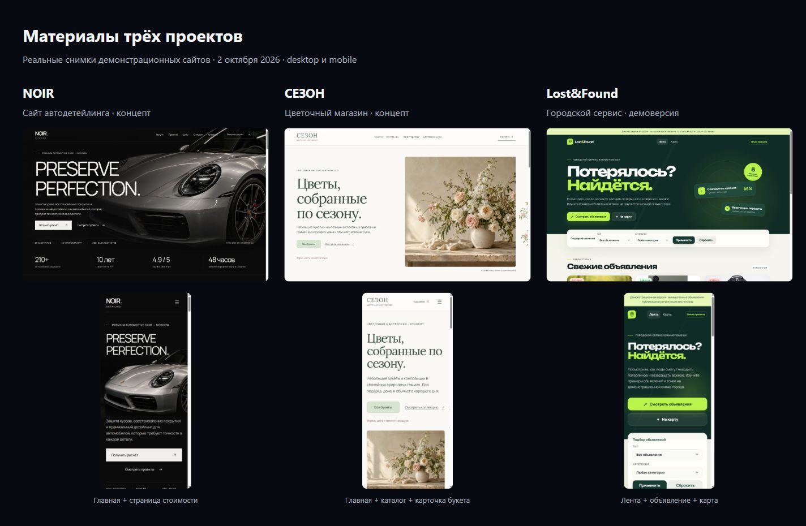

# Материалы проектов

Дата съёмки: 2 октября 2026 года. Снимки собраны агентом через браузер с публичных демонстраций пользователя. Собственные скриншоты пользователя для этих экранов не требуются.

## Состав

В `src/assets/projects/` находятся 16 исходных JPEG-снимков. Для каждой страницы есть desktop/mobile версия. Запрошенные размеры браузера: 1440×900 и 390×844; полные страницы выше, а фактические размеры JPEG могут отличаться из-за обработки снимка браузерным инструментом.

Точные размеры файлов, адреса страниц и тип снимка указаны в [manifest.json](../../src/assets/projects/manifest.json).

| Проект | Страницы | Файлы в `src/assets/projects/` |
| --- | --- | --- |
| NOIR | Главная, стоимость | `noir/home-{desktop,mobile}.jpg`, `noir/pricing-{desktop,mobile}.jpg` |
| СЕЗОН | Главная, каталог, букет «Первый свет» | `sezon/home-{desktop,mobile}.jpg`, `sezon/catalog-{desktop,mobile}.jpg`, `sezon/product-{desktop,mobile}.jpg` |
| Lost&Found | Лента, объявление о Моне, карта | `lostfound/feed-{desktop,mobile}.jpg`, `lostfound/detail-{desktop,mobile}.jpg`, `lostfound/map-{desktop,mobile}.jpg` |

Главные экраны сняты в пределах видимой области; стоимость, каталог, товар, объявление и карта — целиком. Снимки не редактировались, чтобы соответствовать настоящей демонстрации.

## Рабочий мокап

[HTML-мокап ноутбука](media/noir-laptop-preview.html) использует настоящий screenshot NOIR и рамку устройства на CSS. [Снимок мокапа](../../src/assets/projects/noir/laptop-preview.jpg) подготовлен отдельно.

Этот предварительный материал сохранён как рабочая версия этапа 1. В главной он заменён иллюстрацией ниже. Исходный экран NOIR сохранён отдельно; мокап не заменяет его в галерее.

## Иллюстрация главной

[laptop-hero.png](../../src/assets/projects/noir/laptop-hero.png) — фотореалистичная иллюстрация ноутбука с прозрачным фоном, созданная через imagegen на основе настоящего экрана автомобильного NOIR и позы устройства из выбранного референса. Размер — 1536×1024. Это иллюстративное AI-представление устройства и экрана, а не точная копия интерфейса; исходные снимки сайтов не изменены и используются для обложек и будущих галерей кейсов.

Astro Image создаёт WebP и адаптивные варианты иллюстрации; исходный PNG не загружается на страницу напрямую. Итоговая композиция: [desktop](media/stage3-home-1440.jpg), [mobile](media/stage3-full-390.jpg).

## Быстрый просмотр

Исходник обзора: [screenshots-overview.html](media/screenshots-overview.html). HTML-файлы в этой папке — служебные материалы; они не входят в публичные маршруты приложения.

## Подписи и ограничения

- NOIR: «Главная концептуального сайта студии автодетейлинга» / «Страница стоимости и выбора пакета защиты».
- СЕЗОН: «Главная концептуального цветочного магазина» / «Каталог с фильтрами» / «Выбор размера букета». Изображения внутри магазина созданы с AI и обозначены на самом сайте.
- Lost&Found: «Лента демонстрационных объявлений» / «Страница вымышленного объявления» / «Условная схема города с точками».

Показатели и отзывы внутри снимков NOIR относятся к демонстрационному содержанию этого концепта. Они не являются доказательством опыта Егора или реальных клиентских результатов.

Съёмка экранов не заменяет функциональную проверку сценариев для кейсов. Регистрация и публикация Lost&Found отключены, СЕЗОН не принимает реальные заказы и оплату. Эти границы сохраняются в описаниях портфолио.
