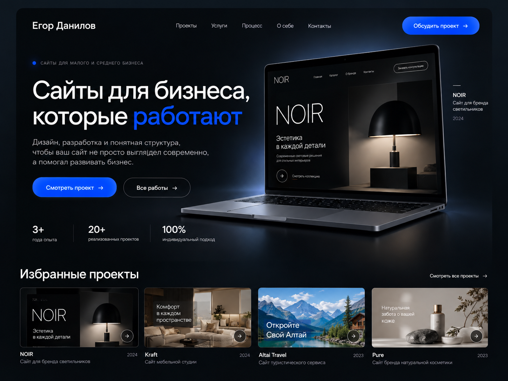

# Документы портфолио Егора Данилова

Актуализировано: 2 октября 2026 года. Главная, кейсы, внутренние страницы, анимации и иллюстрации услуг прошли локальную приёмку. Следующий этап — выбор площадки/домена и публикация. Неблокирующее замечание о быстрых переходах и границы проверки записаны в отчёте.

## С чего начать

| Документ | Назначение |
| --- | --- |
| [Контекст и требования](portfolio-project-context.md) | Для кого сайт, что он должен объяснять, страницы и границы первой версии |
| [Дизайн-бриф](portfolio-design-brief.md) | Композиция по выбранному референсу, токены, адаптивность и движение |
| [Архитектура](ARCHITECTURE.md) | Предлагаемый стек, компоненты, контент, маршруты и публикация |
| [Контент и кейсы](CONTENT-AND-CASES.md) | Тексты, CTA, три проекта, материалы для кейсов и недостающие данные |
| [Медиа проектов](MEDIA-ASSETS.md) | 16 снимков desktop/mobile, адреса исходных страниц и иллюстрация ноутбука NOIR |
| [Сценарии демонстраций](DEMO-SCENARIO-CHECKS.md) | Проверенное поведение исходных сайтов и ограничения утверждений в кейсах |
| [Анимации и взаимодействия](MOTION-AND-INTERACTIONS.md) | Вау-эффекты, реализация, адаптивные ограничения и результаты проверки этапа 5 |
| [Визуализация услуг](SERVICE-VISUALS.md) | Три иллюстрации, исходники, промпты и проверка главной / страницы услуг |
| [План разработки](IMPLEMENTATION-ROADMAP.md) | Порядок задач, зависимости и критерии завершения этапов |
| [Критерии готовности](QUALITY-GATES.md) | Минимальная проверка результата перед выпуском |
| [Финальная приёмка](ACCEPTANCE-REPORT.md) | Фактические результаты этапа 6, исправление и ограничения проверки |
| [Публикация](DEPLOYMENT.md) | GitHub Pages, workflow, переменные публичной сборки и SEO |
| [Задание для Figma](figma-agent-portfolio-prompt.md) | Краткое задание для подготовки макетов по тем же решениям |
| [Агенты и навыки](TOOLING-STATUS.md) | Проверенный состав инструментов и границы выполненной проверки |

## Основной референс

Изображение предоставлено пользователем и сохранено в проекте без изменений. Оно задаёт визуальную композицию, а сведения о проектах и авторе берутся из контентного документа.

## Приоритет решений

1. Последние прямые инструкции пользователя.
2. Выбранный референс и актуальный дизайн-бриф.
3. Требования, архитектура, контент и план из этой папки — каждый в своей области.
4. Общие навыки и настройки Codex.

Корневые `portfolio-project-context.md` и `portfolio-design-brief.md` служат указателями на актуальные документы. Предыдущие списки проектов и светлая основа портфолио заменены текущими решениями.

Выполненные задачи и границы проверки отмечены в плане. Наличие требования в документе не означает готовность соответствующей функции.
